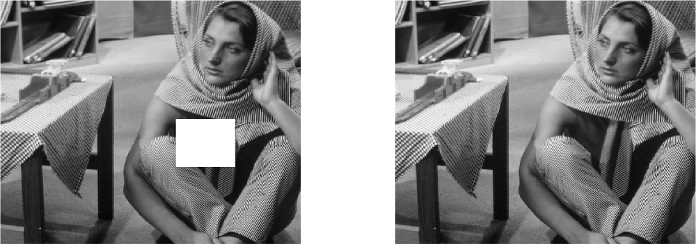
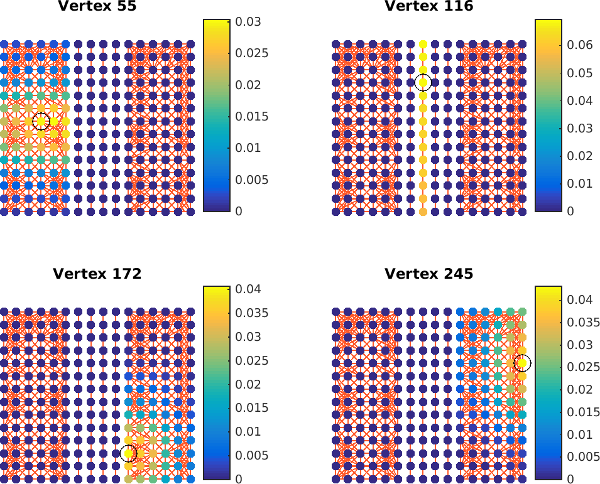
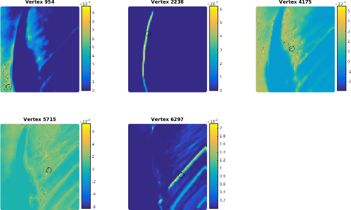
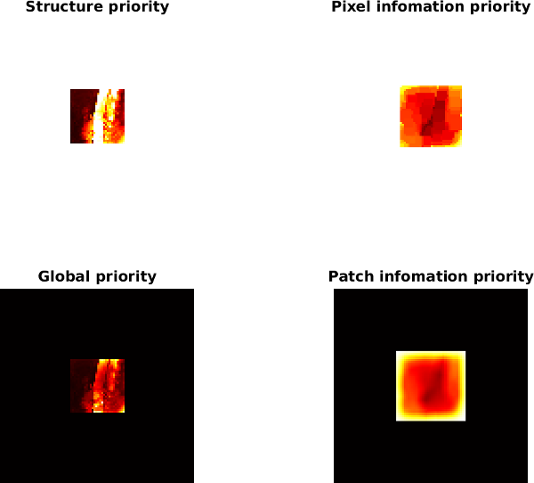

# GIIN: Graph-based Image Inpainting

The project goal was to explore the applications of spectral graph theory to
address the inpainting problem of large missing chunks. We used a non-local
patch graph representation of the image and proposed a structure detector which
leverages the graph representation and influences the fill-order of our
exemplar-based algorithm. Our method achieved state-of-the-art performances.



## The algorithm

1. Identify the potentially fillable unknown pixels.
2. Give a priority to each of them and identify the one with the highest
   priority. We will inpaint that pixel.
3. Find in the image and copy the patch which is the most similar to the patch
   around the chosen pixel.

Our innovation resides in the way to assign a priority to the unknown pixels. We
want to assign a higher priority to the structure than to the texture in order
to preserve it while reconstructing. We do it the following way:

1. Construct a graph of pixels where the edge weights are defined as a
   similarity measure between the connected pixels. 
2. Place a dirac on the considered pixel.
3. Diffuse the dirac with a heat kernel.
   As seen on the image, the diffused signal is constrained by the cluster
   around the tested pixel. From there, we should be able to determine if the
   considered pixel is part of a texture or a structure element. Looking at the
   spreading of the diffusion, texture and structure pixels are easily tell
   apart.
   
   
4. The priority is then given by the l2 norm of the diffused signal. See the
   report for the motivation and mathematical definition.
5. We finally add a confidence priority so that pixels who are farther away from
   the known pixels get lower priorities.
   

## Installation

### Requirements

* [GSPbox](https://lts2.epfl.ch/gsp/): graph signal processing toolbox
  (version 0.4.0 should work)
* [UNLocBoX](https://lts2.epfl.ch/unlocbox/): convex optimization toolbox

### Optional speed-up

The FLANN library implements fast algorithms to approximate nearest neighbors
search. It can be used to speed up the graph construction. It is optional and
if you do not want to use it you can comment `param.nnparam.use_flann = 1;` in
`lib/giin_patch_graph.m`.  Otherwise compile it this way:

```sh
cd gspbox/3rdparty/sources/flann-1.8.4-src/
mkdir build && cd build
cmake ..
make
```

Make sure that the MATLAB bin folder is in your path to compile the MEX. If it
did work you should have a file called `nearest_neighbors.mexa64` in
`build/src/matlab`.

## Usage

1. Place a file `image.png` in the `data` sub-folder. The masked area should be
   bright green, i.e. RGB [0,255,0]. You may want to generate some synthetic
   images with e.g. `giin_image('vertical');`.

2. Launch the inpainting process from MATLAB:

   ```m
   inpaint('vertical');
   ```

   Or from the shell:

   ```sh
   ./launch.sh inpaint vertical
   ```

   You may then want to adjust the paths to the toolboxes in `launch.sh`.
